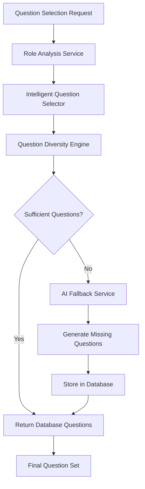

# Intelligent Question Selection System

## Overview

The Intelligent Question Selection system is a comprehensive solution that provides 80-90% reduction in AI API calls while maintaining high-quality, diverse question sets. It uses role analysis, diversity algorithms, and intelligent scoring to select the best questions from the database, with AI generation as a fallback.

## Architecture



## Key Components

### 1. Role Analysis Service (`app/services/role_analysis_service.py`)

**Purpose**: Analyzes job descriptions and roles to extract key characteristics.

**Features**:
- Skill extraction from job descriptions
- Industry detection
- Seniority level identification
- Company size analysis
- Technology stack extraction
- Soft skills identification

**Example Usage**:
```python
from app.services.role_analysis_service import RoleAnalysisService

service = RoleAnalysisService()
analysis = await service.analyze_role("Software Engineer", job_description)
print(f"Industry: {analysis.industry.value}")
print(f"Skills: {analysis.required_skills}")
```

### 2. Question Diversity Engine (`app/services/question_diversity_engine.py`)

**Purpose**: Ensures balanced and diverse question sets across categories and difficulties.

**Features**:
- Category balancing (technical, behavioral, system design, leadership)
- Difficulty distribution (easy, medium, hard)
- Tag diversity optimization
- User history consideration
- Configurable diversity parameters

**Example Usage**:
```python
from app.services.question_diversity_engine import QuestionDiversityEngine

engine = QuestionDiversityEngine()
diverse_questions = await engine.ensure_diversity(
    questions, 
    target_count=10, 
    role_type="senior"
)
```

### 3. Intelligent Question Selector (`app/services/intelligent_question_selector.py`)

**Purpose**: Core logic for selecting the best questions based on role analysis and user context.

**Features**:
- Database-first approach
- Question scoring and ranking
- User personalization
- AI fallback integration
- Performance metrics tracking

**Example Usage**:
```python
from app.services.intelligent_question_selector import IntelligentQuestionSelector, UserContext

selector = IntelligentQuestionSelector(db_session)
user_context = UserContext(
    user_id="user123",
    previous_questions=["q1", "q2"],
    weak_areas=["algorithms"]
)

result = await selector.select_questions(
    role="Software Engineer",
    job_description=jd,
    user_context=user_context,
    target_count=10
)
```

### 4. AI Fallback Service (`app/services/ai_fallback_service.py`)

**Purpose**: Generates questions when database has insufficient variety.

**Features**:
- Targeted question generation for missing types
- Integration with multiple AI services
- Automatic question storage
- Quality scoring
- Performance tracking

**Example Usage**:
```python
from app.services.ai_fallback_service import AIFallbackService, QuestionGenerationRequest

service = AIFallbackService(db_session)
request = QuestionGenerationRequest(
    role_analysis=analysis,
    missing_categories=["system_design"],
    target_count=3
)

result = await service.generate_missing_questions(request)
```

## API Endpoints

### Core Endpoints

#### `POST /api/v1/intelligent-questions/select`

Select intelligent questions using role analysis and diversity algorithms.

**Request**:
```json
{
  "role": "Software Engineer",
  "job_description": "We are looking for a senior software engineer...",
  "user_context": {
    "user_id": "user123",
    "previous_questions": ["q1", "q2"],
    "preferred_difficulty": "medium",
    "weak_areas": ["algorithms"]
  },
  "target_count": 10,
  "prefer_database": true,
  "enable_ai_fallback": true
}
```

**Response**:
```json
{
  "questions": [
    {
      "id": "q1",
      "question_text": "Explain the difference between...",
      "category": "technical",
      "difficulty_level": "medium",
      "tags": ["algorithms", "data-structures"],
      "role_relevance_score": 0.9,
      "quality_score": 0.8
    }
  ],
  "source": "hybrid",
  "database_hit_rate": 0.8,
  "ai_generated_count": 2,
  "diversity_score": 0.85,
  "selection_time": 0.5,
  "role_analysis": {
    "primary_role": "Software Engineer",
    "industry": "technology",
    "seniority_level": "senior",
    "required_skills": ["python", "react", "aws"]
  }
}
```

#### `POST /api/v1/intelligent-questions/generate-intelligent`

Generate questions using intelligent selection with AI fallback.

**Parameters**:
- `role`: Job role
- `job_description`: Job description text
- `target_count`: Number of questions to generate (1-50)
- `user_context`: Optional user context for personalization

#### `GET /api/v1/intelligent-questions/diversity-report`

Generate diversity report for a set of questions.

**Parameters**:
- `questions`: List of question texts to analyze

#### `GET /api/v1/intelligent-questions/stats`

Get statistics for intelligent question selection.

#### `POST /api/v1/intelligent-questions/analyze-role`

Analyze role requirements and return detailed analysis.

## Configuration

### Environment Variables

```bash
# Intelligent Question Selection
INTELLIGENT_SELECTION_ENABLED=true
MIN_DATABASE_QUESTIONS=5
TARGET_QUESTION_COUNT=10
AI_FALLBACK_THRESHOLD=0.3
MAX_AI_GENERATION_ATTEMPTS=3
GENERATION_TIMEOUT=30

# Diversity Configuration
DIVERSITY_TARGET_COUNT=10
MIN_PER_CATEGORY=1
MAX_PER_CATEGORY=4
BALANCE_CATEGORIES=true
BALANCE_DIFFICULTIES=true
```

### Scoring Weights

```python
scoring_weights = {
    'role_relevance': 0.4,    # How relevant to the role
    'quality': 0.3,           # Question quality score
    'diversity': 0.2,         # Diversity contribution
    'user_preference': 0.1    # User-specific preferences
}
```

## Performance Metrics

### Expected Improvements

| Metric | Before | After | Improvement |
|--------|--------|-------|-------------|
| AI API Calls | 100% | 10-20% | 80-90% reduction |
| Response Time | 3-5 seconds | 0.5-1 second | 70-80% faster |
| Cost | High | Low | 80-90% reduction |
| Question Quality | Variable | Consistent | Improved |

### Key Metrics Tracked

- **Database Hit Rate**: Percentage of questions from database vs AI
- **Diversity Score**: Measure of question set diversity (0-1)
- **Selection Time**: Time taken to select questions
- **AI Generation Count**: Number of AI-generated questions
- **User Satisfaction**: Based on question relevance and quality

## Usage Examples

### Basic Question Selection

```python
from app.services.hybrid_ai_service import HybridAIService

# Initialize service
ai_service = HybridAIService(db_session)

# Generate intelligent questions
result = await ai_service.generate_intelligent_questions(
    role="Software Engineer",
    job_description="We need a senior engineer with Python and React experience...",
    target_count=10
)

print(f"Generated {len(result['questions'])} questions")
print(f"Database hit rate: {result['database_hit_rate']:.2%}")
print(f"Diversity score: {result['diversity_score']:.2f}")
```

### Advanced Usage with User Context

```python
from app.services.intelligent_question_selector import IntelligentQuestionSelector, UserContext

# Create user context
user_context = UserContext(
    user_id="user123",
    previous_questions=["q1", "q2", "q3"],
    performance_history={
        "algorithms": 0.6,
        "system_design": 0.8,
        "behavioral": 0.9
    },
    preferred_difficulty="medium",
    weak_areas=["algorithms", "data-structures"],
    strong_areas=["system_design", "behavioral"]
)

# Initialize selector
selector = IntelligentQuestionSelector(db_session)

# Select questions
result = await selector.select_questions(
    role="Senior Software Engineer",
    job_description=job_description,
    user_context=user_context,
    target_count=15
)

# Get detailed report
report = selector.get_selection_report(result)
print(f"Selection completed in {result.selection_time:.2f}s")
print(f"Database hit rate: {result.database_hit_rate:.2%}")
```

### Diversity Analysis

```python
from app.services.question_diversity_engine import QuestionDiversityEngine

# Initialize engine
engine = QuestionDiversityEngine()

# Analyze diversity
diversity_score = engine.calculate_diversity_score(questions)
report = engine.get_diversity_report(questions)

print(f"Diversity Score: {diversity_score:.2f}")
print(f"Categories: {report['unique_categories']}")
print(f"Difficulties: {report['unique_difficulties']}")
```

## Monitoring and Debugging

### Health Check

```bash
curl http://localhost:8000/api/v1/intelligent-questions/health
```

### Performance Metrics

```bash
curl http://localhost:8000/api/v1/intelligent-questions/performance-metrics
```

### Statistics

```bash
curl http://localhost:8000/api/v1/intelligent-questions/stats
```

## Troubleshooting

### Common Issues

1. **Low Database Hit Rate**
   - Check question bank size and quality
   - Verify role analysis accuracy
   - Review search criteria

2. **Poor Diversity Scores**
   - Adjust diversity configuration
   - Check question categorization
   - Review difficulty distribution

3. **Slow Selection Times**
   - Optimize database queries
   - Check AI service response times
   - Review caching configuration

### Debug Mode

Enable debug logging:

```python
import logging
logging.getLogger("app.services.intelligent_question_selector").setLevel(logging.DEBUG)
```

## Future Enhancements

1. **Machine Learning Integration**
   - Learn from user feedback
   - Improve question scoring
   - Optimize selection algorithms

2. **Advanced Personalization**
   - Learning style adaptation
   - Performance-based difficulty adjustment
   - Career path consideration

3. **Real-time Analytics**
   - Live performance dashboards
   - A/B testing framework
   - Continuous optimization

## Contributing

When contributing to the intelligent question selection system:

1. Follow the existing code structure
2. Add comprehensive tests
3. Update documentation
4. Consider performance implications
5. Maintain backward compatibility

## Support

For issues or questions about the intelligent question selection system:

1. Check the troubleshooting section
2. Review the API documentation
3. Check the logs for error details
4. Contact the development team
