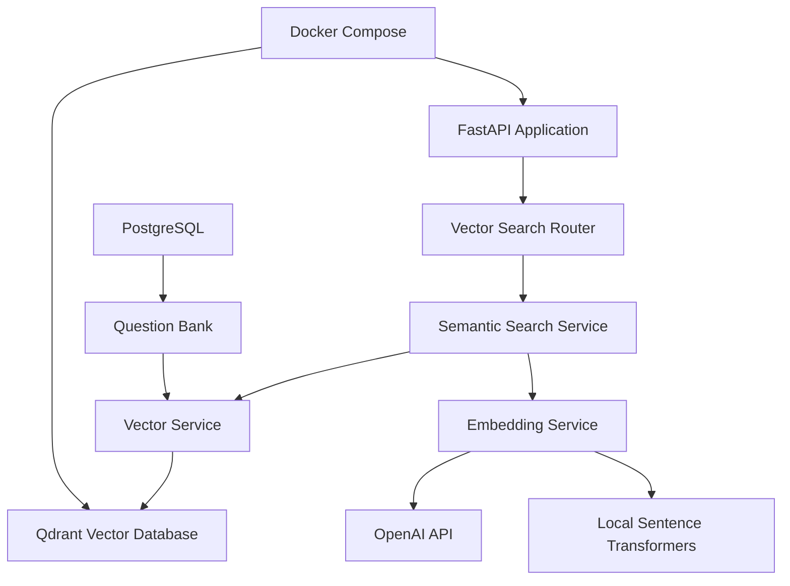

# Vector Database Integration Guide

## 🎯 **Overview**

This guide covers the comprehensive vector database integration with Qdrant, enabling semantic search capabilities for Confida. The integration provides intelligent content discovery, question recommendations, and user pattern analysis.

## 🏗️ **Architecture**

### **Components**



### **Data Flow**

1. **Content Ingestion**: Questions, job descriptions, and user patterns are stored in PostgreSQL
2. **Embedding Generation**: Text content is converted to vector embeddings using OpenAI or local models
3. **Vector Storage**: Embeddings are stored in Qdrant with metadata
4. **Semantic Search**: Queries are converted to embeddings and matched against stored vectors
5. **Results Ranking**: Results are ranked by similarity and filtered by metadata

## 📊 **Vector Collections**

### **Job Descriptions Collection**
- **Purpose**: Store job description embeddings for similarity matching
- **Vector Size**: 1536 (OpenAI) or 384 (local)
- **Distance Metric**: Cosine similarity
- **Metadata**: Role, company, level, skills, created_at

### **Questions Collection**
- **Purpose**: Store question embeddings for intelligent question selection
- **Vector Size**: 1536 (OpenAI) or 384 (local)
- **Distance Metric**: Cosine similarity
- **Metadata**: Difficulty, category, subcategory, role, skills, question_id

### **Answers Collection**
- **Purpose**: Store answer embeddings for pattern analysis
- **Vector Size**: 1536 (OpenAI) or 384 (local)
- **Distance Metric**: Cosine similarity
- **Metadata**: User ID, question ID, session ID, score, created_at

### **User Patterns Collection**
- **Purpose**: Store user behavior patterns for recommendations
- **Vector Size**: 1536 (OpenAI) or 384 (local)
- **Distance Metric**: Cosine similarity
- **Metadata**: User ID, skill level, performance trend, learning style

## 🚀 **Getting Started**

### **Prerequisites**

1. **Docker and Docker Compose** installed
2. **Python 3.8+** with pip
3. **OpenAI API Key** (optional, for OpenAI embeddings)
4. **PostgreSQL** database running

### **Installation**

1. **Install Dependencies**:
```bash
pip install -r requirements.txt
```

2. **Environment Configuration**:
```bash
# Copy environment template
cp env.example .env

# Edit .env file
QDRANT_URL=http://localhost:6333
QDRANT_API_KEY=your_qdrant_api_key  # Optional
OPENAI_API_KEY=your_openai_api_key  # Optional for OpenAI embeddings
```

3. **Start Services**:
```bash
# Start all services including Qdrant
docker-compose up -d

# Or start specific services
docker-compose up -d qdrant database backend
```

4. **Initialize Collections**:
```bash
# Initialize vector collections
curl -X POST "http://localhost:8000/api/v1/vector/collections/initialize"
```

### **Health Check**

```bash
# Check overall health
curl "http://localhost:8000/health"

# Check vector database specifically
curl "http://localhost:8000/api/v1/vector/health"

# Check collection status
curl "http://localhost:8000/api/v1/vector/collections"
```

## 🔧 **API Usage**

### **Question Search**

```python
import requests

# Search for similar questions
response = requests.post("http://localhost:8000/api/v1/vector/search/questions", json={
    "query": "Python async programming concepts",
    "filters": {
        "difficulty": "medium",
        "category": "technical",
        "role": "python_developer"
    },
    "limit": 10
})

results = response.json()
print(f"Found {results['total']} similar questions")
```

### **Job Description Search**

```python
# Search for similar job descriptions
response = requests.post("http://localhost:8000/api/v1/vector/search/job-descriptions", json={
    "query": "Senior Python developer with React experience",
    "role": "python_developer",
    "limit": 5
})

results = response.json()
```

### **Question Suggestions**

```python
# Get question suggestions based on job description
response = requests.post("http://localhost:8000/api/v1/vector/suggestions/questions", json={
    "job_description": "We are looking for a Senior Python Developer with experience in FastAPI, PostgreSQL, and Docker...",
    "role": "python_developer",
    "difficulty": "medium",
    "count": 5
})

suggestions = response.json()
```

### **Content Recommendations**

```python
# Get personalized recommendations
response = requests.post("http://localhost:8000/api/v1/vector/recommendations", json={
    "user_id": "user_123",
    "content_type": "questions",
    "user_profile": {
        "skill_level": "intermediate",
        "learning_style": "practical",
        "preferred_categories": ["technical", "behavioral"]
    },
    "limit": 10
})

recommendations = response.json()
```

### **Embedding Generation**

```python
# Generate single embedding
response = requests.post("http://localhost:8000/api/v1/vector/embeddings/generate", json={
    "text": "Python async programming concepts",
    "model": "text-embedding-3-small",
    "use_cache": True
})

embedding = response.json()["embedding"]

# Generate batch embeddings
response = requests.post("http://localhost:8000/api/v1/vector/embeddings/batch", json={
    "texts": [
        "Python async programming concepts",
        "FastAPI best practices",
        "Database connection pooling"
    ],
    "model": "text-embedding-3-small",
    "batch_size": 100
})

embeddings = response.json()["embeddings"]
```

## 🛠️ **Configuration**

### **Environment Variables**

```bash
# Qdrant Configuration
QDRANT_URL=http://localhost:6333
QDRANT_API_KEY=your_api_key  # Optional

# OpenAI Configuration (for embeddings)
OPENAI_API_KEY=your_openai_api_key

# Embedding Model Configuration
DEFAULT_EMBEDDING_MODEL=text-embedding-3-small
LOCAL_EMBEDDING_MODEL=all-MiniLM-L6-v2

# Cache Configuration
EMBEDDING_CACHE_SIZE=1000
EMBEDDING_CACHE_TTL=3600
```

### **Docker Compose Configuration**

```yaml
services:
  qdrant:
    image: qdrant/qdrant:v1.7.0
    ports:
      - "6333:6333"
      - "6334:6334"
    volumes:
      - qdrant_data:/qdrant/storage
    environment:
      - QDRANT__SERVICE__HTTP_PORT=6333
      - QDRANT__SERVICE__GRPC_PORT=6334
    healthcheck:
      test: ["CMD", "curl", "-f", "http://localhost:6333/health"]
      interval: 30s
      timeout: 10s
      retries: 3
```

## 📈 **Performance Optimization**

### **Embedding Caching**

- **Memory Cache**: In-memory LRU cache for frequently accessed embeddings
- **Cache Size**: Configurable (default: 1000 embeddings)
- **TTL**: Configurable (default: 1 hour)

### **Batch Processing**

- **Batch Size**: Configurable (default: 100 texts per batch)
- **Async Processing**: Non-blocking embedding generation
- **Memory Management**: Automatic cleanup of large batches

### **Vector Index Optimization**

- **Collection Tuning**: Optimized vector parameters for each collection
- **Distance Metrics**: Cosine similarity for semantic search
- **Payload Indexing**: Indexed metadata for fast filtering

## 🔍 **Monitoring and Debugging**

### **Health Endpoints**

```bash
# Overall system health
GET /health

# Vector database health
GET /api/v1/vector/health

# Collection statistics
GET /api/v1/vector/collections

# Available embedding models
GET /api/v1/vector/models
```

### **Monitoring Endpoints**

```bash
# Vector database monitoring
GET /monitoring/vector

# Collection performance metrics
GET /api/v1/vector/collections
```

### **Logging**

The system provides comprehensive logging for:
- Embedding generation (cache hits/misses)
- Vector search operations
- Collection management
- Error handling and debugging

## 🧪 **Testing**

### **Unit Tests**

```bash
# Run vector service tests
pytest tests/unit/test_vector_service.py

# Run embedding service tests
pytest tests/unit/test_embedding_service.py

# Run semantic search tests
pytest tests/unit/test_semantic_search_service.py
```

### **Integration Tests**

```bash
# Run vector search API tests
pytest tests/integration/test_vector_search_api.py

# Run end-to-end vector tests
pytest tests/e2e/test_vector_search_flow.py
```

### **Manual Testing**

```bash
# Test collection initialization
curl -X POST "http://localhost:8000/api/v1/vector/collections/initialize"

# Test question search
curl -X POST "http://localhost:8000/api/v1/vector/search/questions" \
  -H "Content-Type: application/json" \
  -d '{"query": "Python async programming", "limit": 5}'

# Test health check
curl "http://localhost:8000/api/v1/vector/health"
```

## 🚨 **Troubleshooting**

### **Common Issues**

1. **Qdrant Connection Failed**
   - Check if Qdrant is running: `docker-compose ps qdrant`
   - Verify QDRANT_URL environment variable
   - Check network connectivity

2. **Embedding Generation Failed**
   - Verify OpenAI API key if using OpenAI embeddings
   - Check if local model is downloaded
   - Verify text input is not empty

3. **Collection Not Found**
   - Initialize collections: `POST /api/v1/vector/collections/initialize`
   - Check collection status: `GET /api/v1/vector/collections`

4. **High Memory Usage**
   - Reduce embedding cache size
   - Use smaller batch sizes
   - Consider using local embeddings instead of OpenAI

### **Debug Mode**

```bash
# Enable debug logging
export LOG_LEVEL=DEBUG

# Check detailed health information
curl "http://localhost:8000/api/v1/vector/health" | jq
```

## 🔮 **Future Enhancements**

### **Planned Features**

1. **Hybrid Search**: Combine vector search with traditional text search
2. **Real-time Updates**: Live vector updates as content changes
3. **Advanced Filtering**: More sophisticated filtering options
4. **Performance Analytics**: Detailed performance metrics and optimization
5. **Multi-language Support**: Support for multiple languages in embeddings

### **Scalability Improvements**

1. **Distributed Qdrant**: Multi-node Qdrant cluster
2. **Embedding Pipeline**: Async embedding generation pipeline
3. **Caching Layer**: Redis-based embedding cache
4. **Load Balancing**: Multiple embedding service instances

## 📚 **Additional Resources**

- [Qdrant Documentation](https://qdrant.tech/documentation/)
- [OpenAI Embeddings API](https://platform.openai.com/docs/guides/embeddings)
- [Sentence Transformers](https://www.sbert.net/)
- [FastAPI Documentation](https://fastapi.tiangolo.com/)

## 🤝 **Support**

For issues and questions:
1. Check the troubleshooting section
2. Review the logs for error details
3. Check the health endpoints for system status
4. Create an issue in the project repository

---

**This vector database integration provides the foundation for intelligent, semantic search capabilities that significantly enhance the Confida platform's ability to deliver personalized, relevant content to users.**
